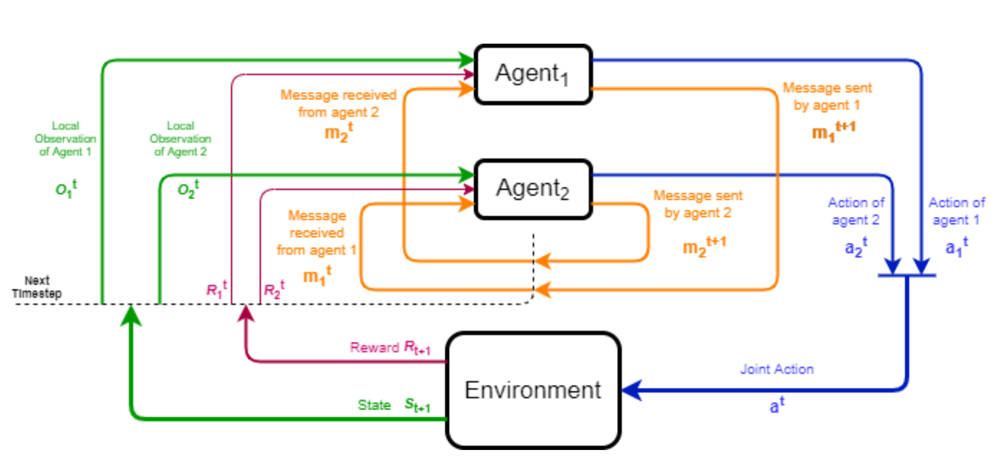

class: title-slide
count: false

# Deep Reinforcement Learning

Lecture 6: Multi-Agent Reinforcement Learning

.grid[
.kol-1-3[
 
**Pascal Leroy** 

[pleroy@uliege.be](mailto:pleroy@uliege.be)
]
.kol-1-2[
.center.width-80[]
]
]

---
# Multi-Agent RL stories:

- Reinforcement basics (SARL)
- Multi-agent RL framework
- Cooperative scenarios
- Communication
- Competitive scenarios
- Adversarial attacks
- References

---

# RL basics: MDP

A Markov decision process (MDP) is defined by:

- A set of states $s \in \mathcal{S}$.
-  A set of actions $u \in \mathcal{U}$.
- Transition function: $s\_{t+1} \sim P(s\_{t+1} | s\_t, u\_t)$.
- Reward function: $r\_t = R(s\_{t+1}, s\_t, u\_t)$.
- Policy: $\pi(u\_t|s\_t)$ <!-- %\mathcal{S} \times \mathcal{A} \rightarrow [0, 1] -->

The agent *goal* is to maximize its total expected sum of (discounted) rewards:

 $\mathbb{E}_{\pi} \left[ \sum_t \gamma^t r_t \right]$ with $\gamma \in [0, 1)$ 

.footnote[Richard S. Sutton and Andrew G. Barto. 2018. Reinforcement Learning: An Introduction. A Bradford Book, Cambridge, MA, USA]

---

# RL basics: DQN

Q-learning with a neural network parametrised by $\theta$:

$$
\mathcal{L}(\theta) = \mathbb{E}\_{\langle s\_{t},u\_{t},r\_{t},s\_{t+1} \rangle \sim B} \big(r\_{t} + \gamma  \underset{u \in \mathcal{U}}{\max} Q(s\_{t+1}, u; \theta') - Q(s\_{t}, u\_{t}; \theta)\big)^2$$

- The replay buffer $B$ is a collection of transitions.
- Sampling transitions allows to update the network.
- $\theta'$ are the parameters of the *target network*, a copy of $\theta$ that is periodically updated.
- To play Atari games:
    - $\theta$ is a CNN.
- When the environment is partially observable (POMDP):
    - $\theta$ is a recurrent network (DRQN).
    - $B$ stores sequences of transitions.

---
# RL basics: Actor-Critic
    
Advantage Actor-Critic:

Actor $\theta$, learns the policy: 

$$
\nabla\_\theta J(\theta)  = \mathbb{E}\_{\tau \sim \pi\_\theta}\left[ \left(\sum\_t^T A(s\_t, u\_t; \phi) \nabla\_\theta \log \pi\_\theta(u\_t, s\_t)  \right) \right]
$$

 
Critic $\phi$, learns the advantage $A(s\_t, u\_t)= Q(s\_t, u\_t) - V(s\_t)$:

 

1. $$ A(s\_t, u\_t; \phi) = r\_t + \gamma V(s\_{t+1}; \phi) - V(s\_t; \phi)
$$
2. $$
 A(s\_t, u\_t; \phi) = Q(s\_t, u\_t; \phi) - \sum\_{u}\pi\_\theta(s\_t, u)Q(s\_t, u; \phi)
$$

---
class: middle

# *Multi-Agent*

# *Reinforcement Learning*

---
# Markov Game 

Markov Game (also referred to as stochastic Game) $[n, \mathcal{S}, O, \mathcal{Z}, \mathcal{U}, r, P, \gamma]$:

- A set of $n$ agents, each one is represented by $a$ or $a\_i, i \in \\{1,...,n\\}$.

- A set of states $s \in \mathcal{S}$.

- An observation function $O:\mathcal{S} \times \{1,...,n\} \rightarrow \mathcal{Z}$.

- A set of action spaces $\mathcal{U}={\mathcal{U}\_1} \times ... \times \mathcal{U}\_n$, one per agent $u^{a\_i}\_t \in \mathcal{U}\_i$.

- A transition function: $ s\_{t+1} \sim P( s\_{t+1} | s\_t , \mathbf{u\_t})$ with $\mathbf{u\_t} =(u^{a\_1}\_t, ..., u^{a\_n}\_t)$.

- A reward function per agent:  $r^{a\_i}\_t = R^{a\_i}(s\_{t+1}, s\_t, \mathbf{u\_t})$.

- Agents sometimes store their history $\tau^a\_t \in (\mathcal{Z} \times \mathcal{U})^t$.

- The *goal* of each agent $ a\_i $ is to maximize its total expected sum of (discounted) rewards 

 $\mathbb{E}_{\mathbf{\pi}} \left[ \sum_t \gamma^t r_t^{a_i} \right]$ with $\gamma \in [0, 1)$ 

---

In Multi-agent settings, the goal of each agent may differ:

1. *Cooperative setting*: all agents share a common goal.

    Examples: traffic control, robotics teams,...

2. *Competitive setting*: the gain of an agent equals the loss of other agents.

    Often referred as zero-sum setting, because the sum of rewards of all agents sums to zero.

    Examples: 1v1 board games, 1v1 video games,...

3. *General sum setting*: lies in between the two others.

    Examples: everything else that is not cooperative or competitive, 5v5 video games,...

---
class: middle
#*Cooperative setting*

---
# Dec-POMDP

In a cooperative setting, it is possible to have a single reward function, each agent receives a same global reward:
$$
r^{a\_1}\_t = r^{a\_n}\_t=r\_t = R(s\_{t+1}, s\_t, \mathbf{u\_t}): \mathcal{S}^2 \times \mathcal{U} \rightarrow \mathbb{R}
$$

Such Markov Games are called Decentralised-POMDP.

.center.width-85[]

---
# StarCraft multi-agent challenge

- SMAC is a Dec-POMDP environment based on StarCraft 2.
- All agents learn to cooperate against the built-in AI.
- This is not a competitive setting because the built-in AI is stationary.

<iframe width="450" height="300" src="https://www.youtube.com/embed/VZ7zmQ_obZ0" title="SMAC: The StarCraft Multi-Agent Challenge" frameborder="0" allow="accelerometer; autoplay; clipboard-write; encrypted-media; gyroscope; picture-in-picture; web-share" allowfullscreen></iframe>

.footnote[https://github.com/oxwhirl/smac  Samvelyan, M., Rashid, T., De Witt, C. S., Farquhar, G., Nardelli, N., Rudner, T. G., ...  Whiteson, S. (2019). The starcraft multi-agent challenge.]

---
# Centralised controller

Centralised controller:
- One agent controls all actions.
- A single joint actions space $\mathcal{U}\_1 \times ... \times \mathcal{U}\_n$.

Problems:

--

- Joint actions space scales exponentially with $n$.
- What about the partial observability?
    - Not possible to centralise.

Solutions:

--

- Decentralised controller.
    - Naive learner: train each agent with SARL methods.
- Centralised training with decentralised execution (CTDE). 
    - Benefit from supplementary information during training, such as the entire state of the game.

---

# Naive learner
Naive learning:

- Ignore the fact that there are multiple learning agents.
- Provide a first baseline to compare algorithms.
- Easy to implement.
- Not so young: a tabular version with IQL (Tan 1993).

Challenges:

--

- Non-stationarity:
    - Other agents are also learning and their policy changes over time.

- Credit assessment: 
    - How an agent learns whether its actions is the one that lead to good (or bad) reward?
    - How an agent maximises the joint actions reward knowing only its action?

---
# Value-based methods in CTDE

Independent Q-Learning (IQL):

- Each agent learns its individual $Q\_a(\tau^a\_t, u^a\_t)$ independently.

Problem:

--

- How to ensure that $\underset{u^a_t}{\arg\max} Q\_a(\tau^a\_t, u^a\_t)$ maximises $Q(s\_t, \mathbf{u\_t})$ ?

Solution: 

--

- Learn $Q(s\_t, \mathbf{u\_t})$ as a function of all $Q\_a(\tau^a\_t, u^a\_t)$ during training.

---

# Individual Global Max

Learn $Q(s\_t, \mathbf{u\_t})$ as a function of all $Q\_a(\tau^a\_t, u^a\_t)$ during training.

*Condition: Individual Global Max (IGM)*
$$
\underset{\mathbf{u\_t}}{\arg\max} Q(s\_t, \mathbf{u\_t}) 
=
\begin{pmatrix}
\underset{u^{a\_1}\_t}{\arg\max} Q\_1(\tau^{a\_1}\_t, u^{a\_1}\_t)\\\\
.\\\\
.\\\\
.\\\\
\underset{u^{a\_n}\_t}{\arg\max} Q\_n(\tau^{a\_n}\_t, u^{a\_n}\_t) 
\end{pmatrix}
$$

$Q_a$ is not a $Q$ function anymore, but a utility function used to select actions.

 

Question: How to satisfy IGM?

---

# VDN

How to satisfy IGM?

*Value Decomposition Network*:
$$
    Q(s\_t, \mathbf{u\_t}) = \sum\_{i=1}^n Q\_{a\_i}(\tau^{a\_i}\_t, u^{a\_i}\_t) 
$$

Problems:

--

- Addition does not allow to build complex functions.
- Current state information $s\_t$ is not considered.

How can we build non-linear factorisation satisfying IGM? 

---
# QMIX

How to build non-linear factorisation satisfying IGM? 

QMIX enforces monotonicity:

$$
    \frac{\partial Q(s\_t, \mathbf{u\_t})}{\partial Q\_{a}(\tau^{a}\_t, u\_t^{a})} \geq 0 \text{ } \forall a \in \{a\_1,..,a\_n\}
$$

How to build a non-linear monotonic factorisation of $Q(s\_t, \mathbf{u\_t})$ as a function of every  $Q\_a(\tau^{a}\_t, u^a\_t)$ and $s\_t$ with neural networks?

--

In QMIX, monotonicity is ensured by constraining a *hypernetwork* that computes the weights of a second neural network.

---

#QMIX architecture

.center.width-100[]
 

.footnote[Rashid, T., Samvelyan, M., Schroeder, C., Farquhar, G., Foerster, J., Whiteson, S. (2018). Qmix: Monotonic value function factorisation for deep multi-agent reinforcement learning.]

---
# QMIX

In QMIX:

- A hypernetwork $h\_p$ takes the state $s\_t$ as input and computes the weights W1 and W2 of a  *second neural network*.
- These weights are constrained to be positive and then used in a *feed forward network $h\_o$* to factorise $Q(s\_t,  \mathbf{u\_t})$ with the individual $Q\_a$.
- A neural network made of monotonic functions and strictly positive weights is monotonic with respect to its inputs.
$$\rightarrow Q\_{mix}(s\_t, \mathbf{u\_t}) = h\_o\left(Q\_{a\_1}(),..,Q\_{a\_n}(), h\_p(s\_t)\right)$$

The optimisation procedure follows the same principles of DQN algorithm:
$$
    \mathcal{L}(\theta) = \mathbb{E}\_{ \langle . \rangle \sim B }
    \bigg[  \big(r\_{t} + \gamma \underset{\mathbf{u} \in \mathcal{U}}{\max} Q\_{mix}(s\_{t+1}, \mathbf{u}; \theta') - Q\_{mix}(s\_{t}, \mathbf{u\_{t}}; \theta)\big)^{2} \bigg]
$$

Parameters of individual networks are commonly shared to speed up learning.

---
# QMIX results

.center.width-100[]

.footnote[Rashid, T., Samvelyan, M., Schroeder, C., Farquhar, G., Foerster, J., Whiteson, S. (2018). Qmix: Monotonic value function factorisation for deep multi-agent reinforcement learning.]

---
# DQV

Deep-Quality Value: learn $Q(.;\theta)$ and $V(.;\phi)$ at the same time.

$$
\mathcal{L}(\theta) = \mathbb{E}\_{\langle s\_t,u\_t,r\_t,s\_{t+1}\rangle\sim B} \bigg[ \big(r\_t + \gamma V(s\_{t+1}; \phi') - Q(s\_t, u\_t; \theta) \big)^{2} \bigg]
$$
$$
\mathcal{L}(\phi) = \mathbb{E}\_{\langle  s\_{t},u\_{t},r\_{t},s\_{t+1}  \rangle\sim B} \bigg[\big(r\_{t} + \gamma V(s\_{t+1}; \phi') - V(s\_{t}; \phi)\big)^{2}\bigg]
$$

One benefit of DQV:
- Reduce the overestimation problem of DQN, linked to the max operator.

DQN loss reminder:
$$
    \mathcal{L}(\theta) = \mathbb{E}\_{\langle s\_{t},u\_{t},r\_{t},s\_{t+1}\rangle \sim B}
    \bigg[ \big(r\_{t} + \gamma \max\_{u \in \mathcal{U}} Q(s\_{t+1}, u; \theta') - Q(s\_{t}, u\_{t}; \theta)\big)^{2}\bigg]
$$

---
# QVMix
QVMix and QVMix-Max are extensions of the Deep-Quality value family of algorithms to cooperative multi-agent.

QVMix:
$$
    \mathcal{L}(\theta) = \mathbb{E}\_{\langle . \rangle \sim B}
    \bigg[\big(r\_{t} + \gamma V(s\_{t+1}; \phi') - Q(s\_{t}, \mathbf{u\_{t}}; \theta)\big)^{2}\bigg]
$$
$$
    \mathcal{L}(\phi) = \mathbb{E}\_{\langle . \rangle\sim B} 
    \bigg[\big(r\_{t} + \gamma V(s\_{t+1}; \phi') - V(s\_{t}; \phi)\big)^{2}\bigg]
$$

QVMix-Max:

$$
    \mathcal{L}(\phi) = \mathbb{E}\_{\langle . \rangle\sim B} 
    \bigg[\big(r\_{t} + \gamma \max\_{\mathbf{u} \in \mathcal{U}} Q(s\_{t+1}, \mathbf{u}; \theta') - V(s\_{t}; \phi)\big)^{2}\bigg]
$$

The architecture of $V$ and $Q$ are the same as that of $Q$ in QMIX, $V$ has a single output.

---
#QVMix results

.center.width-100[]

.footnote[Leroy, P., Ernst, D., Geurts, P., Louppe, G., Pisane, J.,  Sabatelli, M. (2020). QVMix and QVMix-Max: Extending the Deep Quality-Value Family of Algorithms to Cooperative Multi-Agent Reinforcement Learning.]

---
# QVMix overestimation bias

.center.width-100[]

.footnote[Leroy, P., Ernst, D., Geurts, P., Louppe, G., Pisane, J.,  Sabatelli, M. (2020). QVMix and QVMix-Max: Extending the Deep Quality-Value Family of Algorithms to Cooperative Multi-Agent Reinforcement Learning.]

---
# Policy-based methods in CTDE

Naive learner: Independent Actor-Critic (IAC)

- Each agent learns its actor and critic independently.

Two possible critics:

- IAC-V:  $A(\tau\_t, u\_t; \phi) = r + \gamma V(\tau\_{t+1}; \phi) - V(\tau\_t; \phi)$.

- IAC-Q:  $A(\tau\_t, u\_t; \phi) = Q(\tau\_t, u\_t; \phi) - \sum\_{u^a}\pi\_\theta(\tau\_t, u^a)Q(\tau\_t, u^a; \phi)$.

Problem: How to benefit from centralised information such as $s\_t$?

---
#COMA

Problem: How to benefit from centralised information such as $s\_t$?

Solutions proposed by Foerster, et. al. (2018) (COMA):

- Centralised used during training critic that computes the advantage based on $s\_t$.

$$
    A(s\_t,u^a\_t; \phi) = r\_t + \gamma V(s\_{t+1}; \phi) - V(s\_t; \phi)
$$

Problems: 

--

- Based on global rewards $r\_t$.
- The centralised critic does not solve the credit assignment problem.  

---
# COMA 

Solution: use a counterfactual baseline.

- Inspired from difference reward: 

$$D^a=r(s, \mathbf{u}) - r(s, (\mathbf{u}^{-a}, c^a))$$

- The common reward $r(s, \mathbf{u})$ is compared to a reward obtained when agent $a$ executes a default action $c^a$, actions of other agents ($\mathbf{u}^{-a}$) unchanged.

- Any action $u^a$ that maximises $r(s, \mathbf{u})$ also maximises $D^a$.

- Limitations:
--

    1. A simulator is required to obtain $r(s, (\mathbf{u}^{-a}, c^a))$.
        - But these can be approximated.
    2. Decide which action is $c^a$.

---
# COMA

Use a centralised critic that computes difference rewards by learning $Q(s, \mathbf{u})$.

For each agent $a$, the advantage is:
$$ A^a(s, \mathbf{u}) = Q(s, \mathbf{u}) - \sum\_{u'^{a}} \pi^a(u'^{a}|\tau^a) Q(s,(\mathbf{u^{-a}},u'^{a}))  $$

Problem: $(|\mathcal{U}\_1|\*...\*|\mathcal{U}\_n|)$ $Q$ values must be computed.

- In practice, a $Q$ network has one ouput for each possible action.
- Here, this leads to $|\mathcal{U}\_1|\*...\*|\mathcal{U}\_n|$ outputs which is impractical.
- Solution: the critic takes as input $u^{-a}$ and computes only $|\mathcal{U}\_a|$ outputs.

- This method is only possible for discrete action spaces! 
- It is possible to evaluate $\sum\_{u'^{a}} \pi^a(u'^{a}|\tau^a) Q(s,(\mathbf{u^{-a}},u'^{a}))$
    - Monte Carlo 
    - Gaussian policies in continuous action spaces.

---
# COMA architecture

.center.width-100[]

.footnote[Foerster, J., Farquhar, G., Afouras, T., Nardelli, N.,  Whiteson, S. (2018, April). Counterfactual multi-agent policy gradients.]

---
# COMA results

.center.width-90[]
 
.footnote[Foerster, J., Farquhar, G., Afouras, T., Nardelli, N.,  Whiteson, S. (2018, April). Counterfactual multi-agent policy gradients.]

---
# COMA vs QMIX
.center.width-100[]

.footnote[Samvelyan, M., Rashid, T., De Witt, C. S., Farquhar, G., Nardelli, N., Rudner, T. G., ...  Whiteson, S. (2019). The starcraft multi-agent challenge.]

---
# More methods

- MAVEN: Multi-agent variational exploration.

- QTRAN: Learning to factorize with transformation for cooperative multi-agent reinforcement learning.

- QPLEX: Duplex Dueling Multi-Agent Q-Learning.

- LIIR: Learning individual intrinsic reward in multi-agent reinforcement learning.

- MADDPG: Multi-Agent Actor-Critic for Mixed Cooperative-Competitive Environments.

- MAAC: Actor-Attention-Critic for Multi-Agent Reinforcement Learning

- FACMAC: Factored Multi-Agent Centralised Policy Gradients

- HATRPO-HAPPO: Trust Region Policy Optimisation in Multi-Agent Reinforcement Learning

---
# Infrastructure Management Planning

An application for CTDE methods.

- Planning the inspection and maintenance of a structural system can be performed with RL and MARL.

- Joint work in progress with Pablo Morato from the reliability engineering community.

- *Goal:* Decide of inspection and repair actions over time to reduce costs and risks to maintain a system.

- This can be applied to any type of system: civil, maritime, transportation, and urban management setting.

- In our current work: simulated deterioration and off-shore wind turbines.

.footnote[P.G. Morato, K.G. Papakonstantinou, C.P. Andriotis, J.S. Nielsen, P. Rigo, (2022) Optimal inspection and maintenance planning for deteriorating structural components through dynamic Bayesian networks and Markov decision processes.]

---
# IMP sketch

.center.width-100[]

.footnote[Work in progress]

---

# IMP definition
State and observations:

- Belief on the deterioration state of the part.
- Belief is updated with precision depending weither or not you inspected a component of the system. 

Actions: 

1. Do-nothing   /  2. Inspect   /  3. Replace

Reward:
$$
R\_{tot} = \sum\_{t=0}^{T-1} \gamma^t \left[ R\_{t,f} + \bigg[ \sum\_{a=1}^n {R\_{t,ins}^a} + {R\_{t,rep}^a} \bigg] \right]
$$

Failure cost is $R\_f = c\_F \times p\_{Fsys}$ encompassing economic, environmental, and societal losses.

---

# IMP results
Preliminary results on three different systems with 2 or 3 and 50 agents:

k-out-of-n 3 & k-out-of-n correlated 3 &  off shore wind farm 3

.center.width-100[]

k-out-of-n 50 & k-out-of-n correlated 50 &  off shore wind farm 50
.center.width-100[]

---

# Recap

- Dec-POMDP

- Value-based methods
    
    - IQL: each agent learns without considering other agents.
    - QMIX: factorise the $Q(s,\mathbf{u})$ as a function of $Q^a$ and monotonicity.
    - QVMIX: learn both $Q$ and $V$ to reduce overestimation of $Q(s,\mathbf{u})$.
    

- Policy-based methods
    
    - IAC-V, IAC-Q: each agent learns without considering other agents and with different critics.
    - COMA: centralised critic that computes a counterfactual baseline.
    

- Inspection and maintenance planning

---
class: middle

# *Communication*

---
# Communication

.center.width-100[]

.footnote[Fombellida, A. (2020) Battlefield Coordination using Multi-Agent Reinforcement Learning.]

---

# Communication

Communication can be part of the feedback loop.
- Agents take action and send message based on local observations and messages received. 

The two "first" methods: RIAL and DIAL:
- Same as a Markov Game.
- No communication protocol: agents must learn it (difficult).
- Agents select discrete communication action $m \in \mathcal{M}$.
- Many details in the paper.

---

# RIAL
Reinforced inter-agent learning (RIAL) is a first approach:
.grid[
.kol-1-2[
- Agents learn independently $Q^a(o^a\_t, m^{-a}\_{t-1}, u\_t, h\_{t-1})$.
- The network outputs is divided in $|\mathcal{U}|$ $Q^a_u$ and $|\mathcal{M}|$ $Q^a_m$ to avoid computing $|\mathcal{U}||\mathcal{M}|$ outputs.
- Actions and messages are chosen separately from $Q^a_u$ and $Q^a_m$ by an action selector.
- Gradient path in red.
]
.kol-1-2[
.center.width-100[]
]
]

Limitation: Agents do not provide feedbacks on messages sent by others.
 
.footnote[Foerster, J. N., Assael, Y. M., De Freitas, N., Whiteson, S. (2016). Learning to communicate with deep multi-agent reinforcement learning.]

---

# Communication: DIAL

Differentiable inter-agent learning (DIAL).
- Integrate the gradient through the communication channel.
- In RIAL, each agent is trained separately.
- In DIAL, CTDE as training is performed across agents.

Q-Net is now called C-Net and outputs:
1. The $Q$ value, which is fed to the action selector.
2. A *real-valued* message.

---

# DIAL

Constraint: the real-valued message cannot be used during execution.

.grid[
.kol-1-2[
- DIAL introduces a discretise regularise unit (DRU).
- Training: DRU regularises $m$.
- Execution: DRU discretises $m$.
- DIAL extends to continuous messages easily.
- DIAL perform better than RIAL.
- Results in the paper.
]
.kol-1-2[
.center.width-100[]
]
]

.footnote[Foerster, J. N., Assael, Y. M., De Freitas, N., Whiteson, S. (2016). Learning to communicate with deep multi-agent reinforcement learning.]

---

# Challenges in communication

RIAL and DIAL is the first attempt to learn to communicate with deep RL.

Successors to RIAL and DIAL tackle other challenges with new frameworks.

Challenges and some associated papers
- Multi-stage communication (several messages before taking action).
    - Send and receive messages before taking their action.
        - CommNet

- Adapting to various number of agents:
    - CommNet and BiCNet.
- Targeted communication:
    - IC3Net, TarMac and ATOC.
- Limit the number of messages:
    - SchedNet and GACML.

---
class: middle

# *Competition*

---
# Minimax-Q

In a two player competition, gain of one agent is equal loss of the other. 

We can define a new reward function $r^{a\_i}\_t = R^{a\_i}(s\_{t+1}, s\_t, u^{a\_i}\_t, u^{a\_{-i}}\_t)$.

Goal:
- Agent $a\_i$ maximises $r^{a\_i}\_t$.
- Its opponent $a\_{-i}$ minimises $r^{a\_i}\_t$.

Minimax-Q (Littman 1994) ideas:

$$ V^{\pi\*}(s)= \underset{\pi}{\max} \underset{u^{a\_{-i}}}{\min} \sum\_{u^{a\_i} \in \mathcal{U}\_i} Q^{\pi\*}(s, u^{a\_i}, u^{a\_{-i}}) \pi(a\_i|s) $$

$$ Q^{\pi\*}(s, u^{a\_i}, u^{a\_{-i}})=R^{a\_i}(.) + \gamma \sum\_{s'} P(s' | s,u^{a\_i}, u^{a\_{-i}}) V^{\pi\*}(s') $$

---
# AlphaGo Zero

- No details as already covered in Model-Based lecture04.
- [Nice blog](https://www.deepmind.com/blog/alphago-zero-starting-from-scratch)
- Trained with *self-play*!
    - The trained agent acts as both player during training.
- Reminder:
    - Policy and value networks trained to guide MCTS search.
    - AlphaGo Zero: 
        - No supervised learning.
        - No human data.
    - Some numbers:
        - 4.9 million games generated.
        - 1600 games for each MCTS (∼ 0.4s).
        - 700, 000 minibatches of 2, 048 states.

---
# Hide and Seek

<iframe width="660" height="395" src="https://www.youtube.com/embed/kopoLzvh5jY" title="YouTube video player" frameborder="0" allow="accelerometer; autoplay; clipboard-write; encrypted-media; gyroscope; picture-in-picture; web-share" allowfullscreen></iframe>

---
# Hide and Seek

Some details:

.grid[
.kol-1-2[
- Time limit: 240
- Observation space:
    - Position, velocity and size (or objects), in a 135 degree cone in front of the agent.
    - "LIDAR": 30 range sensors around the agent.
- Team based reward
    - Hiders: +1 if hidden, -1 if seen.
    - Seekers: opposite.
    - 0 if no one is seen by the seekers.
]
.kol-1-2[
- Preparation phase: 
    - Only the hiders can perform action in the beginning.
- Action space:
    - Move: discretized forces along x and y axis and torque around their z axis.
    - Grab or lock the closest object in front of them. 2 binaries.
        - Grab: the object is bound to the agent while boolean is True.
        - Lock: the object is locked and cannot be moved. Unlocking is available if the agent is part of the agent team that has locked the object.

]
]

More in the [blog](https://openai.com/blog/emergent-tool-use/)!

---
# Hide and Seek
Training:
- PPO and GAE.
- Centralize training, decentralized execution (CTDE).
    - At training: the critic has access to the full state to learn a centralized value function.
    - At execution: the policy network is used normally.
    - No counterfactual baseline.
- Self-play: each agent acts independently and shares the same network parameters, playing against itself.
- 5% chance of using a past policy version to improve robustness.

Architecture in the [blog](https://openai.com/blog/emergent-tool-use/)!

---
# Hide and Seek
Evaluation:
- Reward in Multi-Agent is not sufficient to evaluate agents.

- Are agents improving evenly or have they stagnated?
    - ELO score (or Trueskill) allows to establish a ranking between policies.
    - Elo score does not differentiate adaptation and improvement of already learned skills.
- Their propose two evaluations scheme.
    - Comparison to intrinsic motivation:
        - Count based exploration: agent receives reward when visiting states that has not been visited much.
    - Inteligence tests: transfer and fine-tuning.

*Goal*: Compare behavior learned in Hide and Seek with common unsupervised exploration techniques.

Results in the [blog](https://openai.com/blog/emergent-tool-use/)!

---

# Competitive: Other works
1. Dota 2, OpenAI Five (2019): Dota 2 with large scale deep reinforcement learning.

2. StarCraft 2, AlphaStar (2019): Grandmaster level in StarCraft II using multi-agent reinforcement learning.

3. Quake 3 capture the flag (2019): Human-level performance in 3D multiplayer games with population-based reinforcement learning.

4. Stratego ($10^{535}$ possible states vs $10^{360}$ possible states in Go): Deep Nash (2022) Mastering the game of Stratego with model-free multiagent reinforcement learning.

---

# AlphaStar

Again, a nice [blog](https://www.deepmind.com/blog/alphastar-mastering-the-real-time-strategy-game-starcraft-ii)!

Population based training.

.center.width-100[]

---
# Two team Markov game
What if we have 2 symmetric teams?
- A set of $n$ agents, each represented by $a$ or $a\_{i, j}, i \in  \{1,...,n\}, j \in \{1, 2\}$.
- A set of states $s \in \mathcal{S}$.
- An observation function $O:\mathcal{S} \times \{1,...,n\} \rightarrow \mathcal{Z}$.
- A set of action spaces $\mathcal{U}=\mathcal{U}\_1 \times ... \times \mathcal{U}\_n$, one per agent $u^{a\_{i,j}}\_{t} \in \mathcal{U}\_i \forall j$.
- A transition function: $s\_{t+1} \sim P(s\_{t+1} | s\_t, \mathbf{u\_t})$,  $\mathbf{u\_t}=(u^{a\_{i,j}}\_t)\_{i \in \{1,..,n\};j \in \{1,2\}} $.
- A reward function per team:  $r^j\_t = R^j(s\_{t+1}, s\_t, \mathbf{u\_t})$.
- Agents store their history $\tau^a\_t \in (\mathcal{Z} \times \mathcal{U})^t$.
- The goal of each agent $a\_i$ is to maximize its total expected sum of (discounted) rewards $\sum\_{t=0}^{T} \gamma^t r^{a\_i}\_t$.

---
# Two team Markov game
How to train a team of agents to compete?

Train against multiple evolving strategies!

- Teams are trained with CTDE methods: QMIX, QVMix and MAVEN.
- Teams are trained with three different learning scenarios:
    1. Against a stationary strategy (heuristic),
    2. Self-play,
    3. Within a population of training teams.
- New Competitive StarCraft Multi-Agent Challenge.
- Teams trained with $10^7$ timesteps in 2 environments ($3m$ and $3s5z$).
- Each method/scenario pair has been executed 10 times.
- Evaluation is performed with Elo scores and win rates.

---
# Elo score

The Elo rating system assign each player of a population with a rating $R$ to rank them.

- We can compute the probability that a player will win against B.
- Let $R\_A$ and $R\_B$ be the ELO scores of player A and B, $E\_A$ = proba A wins.
$$
    E\_A=\frac{10^{R\_A/400}}{10^{R\_A/400} + 10^{R\_B/400}}
    \text{ and }
    E\_B=\frac{10^{R\_B/400}}{10^{R\_A/400} + 10^{R\_B/400}}
$$

- $400$ is a parameter: if the Elo score of player A is 400 points above that of B, it has a ten-times greater chance of defeating B.
- New score where $cst$ is a constant that defines the maximum possible update of the Elo score (10 in our paper, typically 32).
$$
    R'\_A = R\_A + cst \* (S\_A - E\_A)
$$
- $S\_A$ is equal to $1$ for a win, $0$ for a loss and $0.5$ for a draw.

---
# Two team Markov game: results

*H* = trained against heuristic,
*S* = self-play,
*P* = within a population,
*BP* = the 10 bests of each population.

Elo after training (Elo score obtained in different test populations):
.center.width-100[]

.footnote[Leroy, P., Pisane, J., Ernst, D. (2022). Value-based CTDE Methods in Symmetric Two-team Markov Game: from Cooperation to Team Competition.]

---
# Two team Markov game: results
All together:
.center.width-80[]

Conclusions:
- Training teams within a population of learning teams is the best learning scenario, when each team plays the same number of timesteps for training purposes.
- This is irrespective of whether or not the stationary strategy was better than all trained teams.
- A selection procedure is required in the same training population.

.footnote[Leroy, P., Pisane, J., Ernst, D. (2022). Value-based CTDE Methods in Symmetric Two-team Markov Game: from Cooperation to Team Competition.]

---
class: middle
# *Adversarial Attack*

---
# Adversarial Attack

It is possible to trick a neural network with small perturbations.

.center.width-100[]

.footnote[Goodfellow, I. J., Shlens, J., Szegedy, C. (2014). Explaining and harnessing adversarial examples.]

---
# Adversarial Attack

"Adversarial policies: Attacking deep reinforcement learning".

- It is not possible to modify the observation of an other agent.
- But can we attack them with adversarial observation?
- This is the goal of this paper: 
- Learn to win by not directly playing the game but by performing adversarial policies.

Framework: Zero sum Markov Game.

Goal: black box attack by learning adversary policies.

[adversarialpolicies.github.io](https://adversarialpolicies.github.io/)

---

# Adversarial Attack

<iframe width="660" height="395" src="https://www.youtube.com/embed/XPFQ9TBvtCE" title="YouTube video player" frameborder="0" allow="accelerometer; autoplay; mute; clipboard-write; encrypted-media; gyroscope; picture-in-picture; web-share" allowfullscreen></iframe>

 

---
# Adversarial attacks

How to attack a trained agent?

- Victims are trained with self-play.
- In the paper, they take pre-trained networks between $680$ and $1360$ millions timesteps.
- By fixing the victim policy $\pi\_\nu$, an adversarial policy $\pi\_\alpha$ is trained.
- Note that the agent is now in a MDP since $\pi_\nu$ is now stationary.
- Adversarial policy is trained for $20$ millions timesteps.

Attacks are validated by masking the position of the attacker from the victim which now wins:
- The attacker did not learn a strong policy.

Fine-tuning against the attacker allows to defend against these attacks.

---
# References
- Bible: Richard S. Sutton and Andrew G. Barto. (2018) Reinforcement Learning: An Introduction.
- DQN: Mnih, V., Kavukcuoglu, K., Silver, D. et al. (2015). Human-level control through deep reinforcement learning.
- DRQN: Hausknecht, M., Stone, P. (2015). Deep recurrent q-learning for partially observable mdps.
- Actor-critic: Konda, V., & Tsitsiklis, J. (1999). Actor-critic algorithms. 
- Markov Game and Minimax Q: Littman, M. L. (1994). Markov games as a framework for multi-agent reinforcement learning.
- Dec-POMDP: Oliehoek, F. A., Amato, C. (2016). A concise introduction to decentralized POMDPs.
- IQL: Tan, M. (1993). Multi-agent reinforcement learning: Independent vs. cooperative agents.

---

- IGM and QTRAN: Son, K., Kim, D., Kang, W.J., Hostallero, D.E. , Yi, Y.. (2019). QTRAN: Learning to Factorize with Transformation for Cooperative Multi-Agent Reinforcement Learning.
- VDN: Sunehag, P., Lever, G., Gruslys, A., Czarnecki, W. M., Zambaldi, V., Jaderberg, M., ...  Graepel, T. (2017). Value-decomposition networks for cooperative multi-agent learning.
- QMIX: Samvelyan, M., Rashid, T., De Witt, C. S., Farquhar, G., Nardelli, N., Rudner, T. G., ...  Whiteson, S. (2019). The starcraft multi-agent challenge.
- COMA: Foerster, J., Farquhar, G., Afouras, T., Nardelli, N.,  Whiteson, S. (2018, April). Counterfactual multi-agent policy gradients. 
- DQV: Sabatelli, M., Louppe, G., Geurts, P., & Wiering, M. A. (2020, July). The deep quality-value family of deep reinforcement learning algorithms.
- QVMix: Leroy, P., Ernst, D., Geurts, P., Louppe, G., Pisane, J.,  Sabatelli, M. (2020). QVMix and QVMix-Max: Extending the Deep Quality-Value Family of Algorithms to Cooperative Multi-Agent Reinforcement Learning.

---

- MAVEN: Mahajan, A., Rashid, T., Samvelyan, M., & Whiteson, S. (2019). Maven: Multi-agent variational exploration.
- QPLEX: Wang, J., Ren, Z., Liu, T., Yu, Y., & Zhang, C. (2020). Qplex: Duplex dueling multi-agent q-learning.
- LIIR: Du, Y., Han, L., Fang, M., Liu, J., Dai, T., & Tao, D. (2019). Liir: Learning individual intrinsic reward in multi-agent reinforcement learning.
- MADDPG: Lowe, R., Wu, Y. I., Tamar, A., Harb, J., Pieter Abbeel, O., & Mordatch, I. (2017). Multi-agent actor-critic for mixed cooperative-competitive environments.
- MAAC: Iqbal, S., & Sha, F. (2019). Actor-attention-critic for multi-agent reinforcement learning.
- FACMAC: Peng, B., Rashid, T., Schroeder de Witt, C., Kamienny, P. A., Torr, P., Böhmer, W., & Whiteson, S. (2021). Facmac: Factored multi-agent centralised policy gradients. 
- HATRPO-HAPPO: Kuba, J. G., Chen, R., Wen, M., Wen, Y., Sun, F., Wang, J., & Yang, Y. (2021). Trust region policy optimisation in multi-agent reinforcement learning. 

---
- RIAL/DIAL: Foerster, J. N., Assael, Y. M., De Freitas, N., Whiteson, S. (2016). Learning to communicate with deep multi-agent reinforcement learning.
- CommNet: Sukhbaatar, Sainbayar, Arthur Szlam, and Rob Fergus (2016). Learning multiagent communication with backpropagation.
- BiCNet: Peng, Peng et al. (2017). Multiagent Bidirectionally-Coordinated Nets: Emergence of Human-level Coordination in Learning to Play StarCraft Combat Games.
- IC3Net: Singh, Amanpreet, Tushar Jain, and Sainbayar Sukhbaatar (2019). Learning when to communicate at scale in multiagent cooperative and competitive tasks.
- TarMac: Das, Abhishek et al. (2019). TarMAC: Targeted multi-agent communication.
- ATOC: Jiang, Jiechuan and Zongqing Lu (2018). Learning attentional communication for multi-agent cooperation.
- SchedNet: Kim, Daewoo et al. (2019). Learning to schedule communication in multi-agent reinforcement learning.
- GACML: Mao, Hangyu et al. (2019). Learning Agent Communication under Limited Bandwidth by Message Pruning.

---

- AlphaGo: Silver, D., Huang, A., Maddison, C. J., Guez, A., Sifre, L., Van Den Driessche, G., ... Hassabis, D. (2016). Mastering the game of Go with deep neural networks and tree search.
- AlphaGo Zero: Silver, D., Schrittwieser, J., Simonyan, K., Antonoglou, I., Huang, A., Guez, A., ... Hassabis, D. (2017). Mastering the game of go without human knowledge.
- OpenAI Five: Berner, C., Brockman, G., Chan, B., Cheung, V., ... Zhang, S. (2019). Dota 2 with large scale deep reinforcement learning. 
- AlphaStar: Vinyals, O., Babuschkin, I., Czarnecki, W. M., Mathieu, M., Dudzik, A., Chung, J., ... Silver, D. (2019). Grandmaster level in StarCraft II using multi-agent reinforcement learning.
- Capture the Flag: Jaderberg, M., Czarnecki, W. M., Dunning, I., Marris, L., Lever, G., Castaneda, A. G., ...  Graepel, T. (2019). Human-level performance in 3D multiplayer games with population-based reinforcement learning.

---

- Hide and Seek: Baker, B., Kanitscheider, I., Markov, T., Wu, Y., Powell, G., McGrew, B., Mordatch, I. (2019). Emergent tool use from multi-agent autocurricula. 
- Stratego: Perolat, J., De Vylder, B., Hennes, D., Tarassov, E., Strub, F., de Boer, V.,..., Tuyls, K. (2022). Mastering the game of Stratego with model-free multiagent reinforcement learning. Science.
- Two-team Markov Game: Leroy, P., Pisane, J., Ernst, D. (2022). Value-based CTDE Methods in Symmetric Two-team Markov Game: from Cooperation to Team Competition. In Deep Reinforcement Learning Workshop, NeurIPS.
- Adversarial policies: Gleave, A., Dennis, M., Wild, C., Kant, N., Levine, S.,  Russell, S. (2019). Adversarial policies: Attacking deep reinforcement learning. 

---

class: end-slide, center
count: false

Thanks!